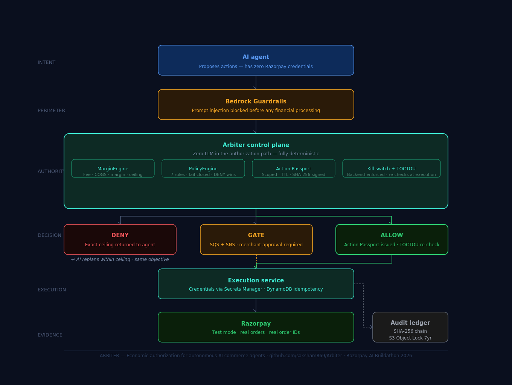

<div align="center">

<h1>Arbiter</h1>

<p><strong>Economic authorization layer for autonomous AI commerce agents</strong></p>

<p>
  
  
  
  
</p>

<br/>

> **"If the AI is compromised, the money still isn't."**

<br/>

</div>

---

## What is Arbiter?

Arbiter is a **control plane** that sits between an AI commerce agent and Razorpay. The AI proposes discount offers. Arbiter decides whether those offers are economically safe. Razorpay executes — but only when Arbiter says so.

The AI cannot authorize itself. The AI cannot touch Razorpay credentials. The AI cannot override the margin floor. These are not policy statements — they are enforced architecturally.

---

## The Problem

> AI agents optimize for what they can measure. They cannot measure cost of goods.

Razorpay's Orders API tells an agent what a product *sells* for. It does not tell the agent what it *costs* to produce, what the Razorpay MDR fee is, or what the return rate exposure is.

**A 30% discount that looks like growth to an LLM:**

```
Customer pays                    Rs.944.30
Razorpay fee (2% + 18% GST)    - Rs.22.29
Cost of goods (COGS)            - Rs.830.00
------------------------------------------
Merchant profit                   Rs.92.01   <- 9.74% margin
Required floor                    18.00%
Loss per sale                   - Rs.70.19
```

The agent "succeeded." It created an order. The merchant lost Rs.70.19 per unit. At 100 proposals/day — Rs.7,000/day in hidden losses.

---

## The Solution

```
+-------------------------------------------------+
|                                                 |
|  The AI decides what it wants to accomplish.   |
|  It cannot decide what it is authorized to do. |
|                                                 |
+-------------------------------------------------+
```

Arbiter is the layer between those two statements. Every proposed financial action passes through economic authorization before any Razorpay call is made.

---

## Architecture

```
+----------------------------------------------------------+
|  UNTRUSTED ZONE                                          |
|                                                          |
|  AI Growth Agent  (Claude Haiku 4.5 via AWS Bedrock)     |
|  - Observes order history                                |
|  - Discovers co-purchase patterns                        |
|  - Proposes discount bundle strategies                   |
|  - Has ZERO Razorpay credentials                         |
|                                                          |
|  $ grep -rn "razorpay" agent/  ->  0 results            |
+----------------------+-----------------------------------+
                       |  POST /control/propose
                       |  (proposal only - no credentials)
                       v
+----------------------------------------------------------+
|  GUARDRAIL BOUNDARY                                      |
|  Bedrock Guardrails  (ID: 9cq40q5l324c)                  |
|  - Screens for prompt injection                          |
|  - Blocks denied topics before any financial processing  |
+----------------------+-----------------------------------+
                       |  Screened proposal
                       v
+----------------------------------------------------------+
|  TRUSTED CONTROL PLANE  <- Arbiter Core                 |
|                                                          |
|  MarginEngine     Zero LLM. Zero network. Pure math.     |
|  PolicyEngine     7 rules. Fail-closed. DENY wins.       |
|  EconomicScore    100-point heuristic authorization.     |
|  ActionPassport   Scoped, TTL, SHA-256 hash-signed.      |
|                                                          |
|  Cannot be overridden by the agent.                      |
+----------------------+-----------------------------------+
                       |  Action Passport
                       |  (scoped token - NOT credentials)
                       v
+----------------------------------------------------------+
|  EXECUTION BOUNDARY                                      |
|  ExecutionService                                        |
|  - Razorpay credentials live here ONLY                   |
|  - Loaded from AWS Secrets Manager at runtime            |
|  - DynamoDB idempotency - no duplicate orders            |
|  - 5xx -> UNKNOWN -> QUARANTINE -> SAFE_HALT             |
+----------------------+-----------------------------------+
                       |  Razorpay API
                       v
+----------------------------------------------------------+
|  RAZORPAY  (Test Mode)                                   |
|  Real orders - Real order IDs - Real amounts             |
+----------------------+-----------------------------------+
                       |
                       v
+----------------------------------------------------------+
|  EVIDENCE LEDGER                                         |
|  SHA-256 hash chain  (MariaDB)                           |
|  S3 Object Lock - COMPLIANCE mode - 7-year retention     |
|  Every ALLOW, DENY, GATE, UNKNOWN recorded               |
+----------------------------------------------------------+
```

---

## Authorization Flow — Step by Step

```
STEP 1   Agent proposes
         POST /control/propose  {items, discount_pct, rationale}
         No credentials. No Razorpay access. Proposal only.

STEP 2   Bedrock Guardrails screens
         Prompt injection check.
         If blocked -> halt. No financial processing continues.

STEP 3   MarginEngine calculates
         fee     = paid x 2%
         gst     = fee x 18%
         cogs    = sum(catalog[sku] x qty)
         margin  = paid - fee - gst - cogs
         ceiling = cogs / (k - floor)   <- closed-form formula

STEP 4   PolicyEngine evaluates 7 rules
         Rule 1:  unknown_cogs      -> DENY
         Rule 2:  return_rate > 25% -> DENY
         Rule 3:  margin < floor    -> DENY  +  {ceiling constraint}
         Rule 4:  discount > 20%    -> GATE
         Rule 5:  amount > Rs.5000  -> GATE
         Rule 6:  velocity > 10/min -> DENY
         Rule 7:  default           -> ALLOW

STEP 5   Decision issued
         DENY  -> constraint returned -> agent replans within ceiling
         GATE  -> SQS + SNS email -> human approves or rejects
         ALLOW -> passport issued

STEP 6   Action Passport issued  (ALLOW path only)
         allowed_action:    DISCOUNT_OFFER
         max_discount_pct:  22.74
         authorized_amount: Rs.1106.18
         policy_version:    1
         valid_until:       +5 min TTL
         passport_hash:     SHA-256 signed

STEP 7   TOCTOU revalidation at execution time
         Reload catalog + policy from disk
         Re-enrich COGS for all items
         Re-run PolicyEngine
         Execute only if still ALLOW

STEP 8   ExecutionService calls Razorpay
         Credentials loaded from Secrets Manager
         DynamoDB idempotency check first
         razorpay.orders.create(amount, offers=[offer_id])

STEP 9   Outcome
         2xx -> SUCCESS
         4xx -> FAILED
         5xx -> UNKNOWN -> QUARANTINE -> SAFE_HALT  (no retry)

STEP 10  Ledger written
         SHA-256 hash chain entry appended
         S3 Object Lock  (COMPLIANCE, 7yr)
         Every decision recorded - DENY as prominently as ALLOW
```

---

## The DENY → Replan → ALLOW Loop

The agent is **constrained, not blocked.** When Arbiter denies a proposal, it returns the exact ceiling. The agent replans within it.

```
Attempt 1                              Attempt 2
-----------------------------------    -----------------------------------
Agent:   28% discount                  Agent reads constraint.
Margin:  12.19%          DENY  ----->  Replans to 18% discount.
Floor:   18.00%                        Margin:    22.56%
Reason:  margin_floor                  Eco score: 70.4/100
Constraint:                            Decision:  ALLOW
  max_discount_pct: 22.74              Passport:  issued
replan:  required: true                Razorpay:  order_TVhBe2pu2TkAiI
objective_preserved: true              S3 lock:   written

The objective stayed constant. The strategy changed.
```

---

## Three Decisions

| Decision | Trigger | What happens |
|---|---|---|
| **DENY** | Margin below floor, unknown COGS, return risk, velocity | Exact constraint returned. Agent replans. No Razorpay call. |
| **GATE** | Discount or amount exceeds auto-approve threshold | SQS queue. SNS email with APPROVE/REJECT links. Re-authorized on human approve. |
| **ALLOW** | All 7 rules pass | Action Passport issued. TOCTOU revalidation. Razorpay execution. |

---

## Key Features

### Economic Authorization
- **MarginEngine** — pure arithmetic, zero LLM, zero network calls in the authorization path
- Closed-form discount ceiling formula — mathematically precise, not approximated
- All amounts in integer paise — no floating-point money
- COGS only from the trusted catalog — agent cannot inject cost basis

### Policy Engine — 7 Rules, Fail-Closed
- DENY always beats ALLOW
- Unknown or missing policy defaults to DENY — never ALLOW
- Each DENY returns the exact constraint so the agent can replan intelligently

### Action Passport
- Scoped to exact action, amount, and policy version
- 5-minute TTL — cannot be reused after expiry
- SHA-256 hash-signed — cannot be forged or modified
- Policy version binding — old passports rejected after policy updates

### Security Controls
- **TOCTOU revalidation** — economics re-checked at execution time, not just proposal time
- **GATE re-authorization** — human approval triggers fresh policy check before execution
- **Concurrent idempotency** — DynamoDB prevents duplicate Razorpay orders from simultaneous approvals
- **Kill switch** — backend-enforced pause of all autonomous execution (L0-L4 autonomy levels)

### Immutable Audit Trail
- SHA-256 hash chain in MariaDB — tamper detection on every record
- S3 Object Lock COMPLIANCE mode, 7-year retention — immutable evidence
- Every DENY recorded as prominently as every ALLOW

### Multimodal COGS Extraction
- Upload supplier invoice image — Claude vision extracts SKU, product, COGS, confidence
- Pending human approval before entering the trusted catalog
- AI extracts. Humans establish financial truth.

---

## Experiment Results

```
50 holdout orders - 27 control - 23 treatment
Split by ORDER_ID hash - deterministic, reproducible

Average Order Value
  Control:    Rs.1377.33
  Treatment:  Rs.1207.21
  Lift:       -12.4%    <- reported in full, not hidden

Contribution Margin  (primary metric - not AOV)
  Control:    Rs.494.43
  Treatment:  Rs.473.55
  Lift:       -4.2%

Category breakdown
  Accessories   +213.1%  pass
  Apparel         -3.9%  loss
  Fitness        -14.9%  loss
  Footwear       -18.4%  loss
  Electronics   -100.0%  loss  (n=1, not meaningful)

Statistical power: LOW  (n=50 underpowered)
Results are directional only - not causal evidence.
```

> **"A control plane that cannot be bribed by vanity metrics is the point."**

---

## Security — Provable Claims

| Reviewer question | Answer | Proof |
|---|---|---|
| Can AI execute Razorpay directly? | **NO** | `grep -rn "razorpay" agent/` → 0 results |
| Can AI modify merchant policy? | **NO** | No `/policy` endpoint in agent permissions |
| Can expired passport execute? | **NO** | `validate_passport()` → `passport_expired` |
| Can passport be replayed? | **NO** | `exec_status` check + DynamoDB idempotency |
| Can stale policy execute a passport? | **NO** | `passport_stale_policy:v1→v2` check |
| Can concurrent approve double-execute? | **NO** | `test_concurrent_approval` → 1 order from 2 threads |
| Can unknown COGS be authorized? | **NO** | `test_unknown_cogs_never_allow` |
| Can Razorpay 5xx become SUCCESS? | **NO** | UNKNOWN → QUARANTINE → SAFE_HALT |
| Can ledger tampering go undetected? | **NO** | `test_tamper_detected` — SHA-256 chain breaks |
| Can kill switch be bypassed? | **NO** | `test_kill_switch_blocks_execution` |
| Can LLM social engineering override policy? | **NO** | 9/9 live attacks blocked — Security page |
| Does higher COGS ever raise the ceiling? | **NO** | `test_margin_ceiling_invariant_higher_cogs` |

---

## Tech Stack

| Layer | Technology | Why |
|---|---|---|
| Agent | Claude Haiku 4.5 (AWS Bedrock) | Reasoning and multimodal invoice extraction |
| Guardrails | AWS Bedrock Guardrails | Prompt injection screening |
| API | FastAPI (Python 3.9) | Control plane endpoints |
| Auth engine | Pure Python — zero LLM | Deterministic authorization |
| Database | MariaDB (Docker) | Hash-chain audit ledger |
| Idempotency | AWS DynamoDB | Duplicate execution prevention |
| Queue | AWS SQS | GATE action persistence |
| Notifications | AWS SNS | Merchant APPROVE/REJECT email |
| Evidence | AWS S3 Object Lock (COMPLIANCE) | Immutable 7-year audit record |
| Metrics | AWS CloudWatch | Decision monitoring |
| Secrets | AWS Secrets Manager | Razorpay credential isolation |
| Payment | Razorpay (Test Mode) | Real order execution |
| Frontend | Vanilla HTML/CSS/JS | Governance console |

---

## AWS Infrastructure

| Service | Resource | What fails without it |
|---|---|---|
| Bedrock Claude Haiku 4.5 | us-east-1 | Agent cannot reason or replan |
| Bedrock Guardrails | 9cq40q5l324c | Prompt injection reaches control plane |
| DynamoDB | mg-idempotency | Restart loses idempotency — duplicate orders |
| SQS | mg-approval-queue + dlq | GATE actions never reach merchant |
| SNS | mg-merchant-notifications | No APPROVE/REJECT email |
| S3 Object Lock | mg-audit-trail (COMPLIANCE, 7yr) | Evidence deletable |
| CloudWatch | Arbiter namespace | No operational visibility |
| Secrets Manager | mg-razorpay-credentials | Credentials in code or .env |
| Lambda | mg-approval-handler | Email approval link has no handler |

---


## Architecture



## Governance Console

10-page dashboard at `http://localhost:8085/dashboard`:

| Page | What it shows |
|---|---|
| **Overview** | Real-time decisions, control rate, economic score, hash chain status |
| **Proposals** | Every proposal. Click any row → exact margin math in the detail drawer |
| **Authorization replay** | 13-step animated pipeline for any ALLOW decision |
| **Approval queue** | Real GATE cards. Approve → real Razorpay order created |
| **Experiments** | Honest A/B results (−12.4% shown). Integrity panel. Statistical power: LOW |
| **Policies** | Editable controls. Policy impact simulator |
| **Catalog** | Upload invoice → Claude extracts COGS → human approves |
| **Audit trail** | Hash chain. Click "Run /audit/verify" → `intact:true` live |
| **Quarantine** | UNKNOWN actions. Confirm/resolve writes audit events |
| **Agent runtime** | Kill switch (live backend). L0-L4 autonomy levels |
| **Security** | Trust boundary. AI intent vs authority. Live attack mode (9/9 blocked) |

---

## Test Suite

```
test_margin.py      30 tests   fee math, ceiling formula, boundary inputs, invariants
test_policy.py      14 tests   all 7 rules, fail-closed, DENY wins
test_ledger.py      12 tests   SHA-256 chain correctness, tamper detection
adversary/          14 tests   attack scenarios + concurrent idempotency
------------------------------------------
Total               70 passing - 1 skipped
```

**14 adversary scenarios — all passing:**

```
01  Prompt injection in rationale       -> BLOCKED
02  Unknown SKU (no COGS in catalog)    -> DENIED
03  High return rate (SHIRT-1, 28%)     -> DENIED
04  30% discount -> margin floor        -> DENIED
05  Velocity abuse (11 rapid calls)     -> DENIED
06  Corrupt policy -> fail-closed       -> DENIED
07  Razorpay 5xx -> UNKNOWN             -> QUARANTINE
08  Ledger row tampered                 -> DETECTED
09  Kill switch blocks execution        -> GATED
10  Below floor (WATCH-1 at 15%)        -> DENIED
11  Stale SKU -> unknown COGS           -> DENIED
12  Return risk blocks high-return SKU  -> DENIED
13  Velocity limit enforced             -> DENIED
14  Concurrent approval -> 1 order only -> IDEMPOTENT
```

**9 economic invariants proven:**

```
INV-1  Higher COGS never raises the discount ceiling
INV-2  Higher margin floor never raises the ceiling
INV-3  Higher discount never improves margin percentage
INV-4  Unknown COGS never produces ALLOW
INV-5  Zero COGS computes correctly — no divide by zero
INV-6  100% discount (paid=0) handled without crash
INV-7  Huge quantity (10,000 units) — no integer overflow
INV-8  Duplicate SKU — handled without error
INV-9  Negative discount (paid > list) — handled gracefully
```

---

## Quick Start

**Prerequisites:** Python 3.9+, Docker, AWS account (Bedrock us-east-1), Razorpay test account

```bash
git clone https://github.com/saksham869/Arbiter.git
cd Arbiter
cp .env.example .env
# Edit .env with your AWS + Razorpay credentials

docker compose up -d
python3 -m uvicorn control.app:app --port 8085 --log-level warning &
open http://localhost:8085/dashboard

python3 -m pytest tests/ -q
# 70 passed, 1 skipped
```

**Demo commands:**

```bash
# DENY — 30% discount destroys margin
curl -s -X POST http://localhost:8085/control/propose \
  -H "Content-Type: application/json" \
  -d '{"objective":{"type":"upsell","target_sku":"SHOE-001","horizon_days":7},"action":{"type":"DISCOUNT_OFFER","items":[{"sku":"SHOE-001","quantity":1,"list_price_paise":120000},{"sku":"SOCK-3PK","quantity":1,"list_price_paise":29900}],"discount_pct":30},"rationale":"aggressive growth","attempt_no":1}' \
  | python3 -m json.tool

# ALLOW — 18% passes all checks -> real Razorpay order ID returned
curl -s -X POST http://localhost:8085/control/propose \
  -H "Content-Type: application/json" \
  -d '{"objective":{"type":"upsell","target_sku":"SHOE-001","horizon_days":7},"action":{"type":"DISCOUNT_OFFER","items":[{"sku":"SHOE-001","quantity":1,"list_price_paise":120000},{"sku":"SOCK-3PK","quantity":1,"list_price_paise":29900}],"discount_pct":18},"rationale":"within ceiling","attempt_no":2}' \
  | python3 -m json.tool

# Verify audit chain integrity
curl -s http://localhost:8085/control/audit/verify
# {"intact": true, "checked": N}
```

---

## Key API Endpoints

```
POST  /control/propose                Submit AI proposal for authorization
GET   /control/audit                  Decision ledger (hash chain)
GET   /control/audit/verify           Verify SHA-256 chain integrity
POST  /control/dashboard/approve      Human approve a GATE action
POST  /control/dashboard/reject       Human reject a GATE action
GET   /control/health                 System health (DB, Bedrock, Razorpay)
POST  /control/kill-switch/activate   Pause all autonomous execution
POST  /control/kill-switch/deactivate Resume autonomous execution
POST  /control/catalog/extract-bytes  Multimodal COGS extraction from invoice
POST  /control/quarantine/resolve     Resolve UNKNOWN execution state
```

---

## Graceful Degradation

| Dependency fails | System behavior |
|---|---|
| Bedrock (agent) | No new proposals. Existing passports unaffected. |
| Bedrock Guardrails | Proposals blocked at perimeter. SAFE_HALT. |
| MariaDB | No authorization decisions. No ledger writes. System halts. |
| DynamoDB | No execution. No Razorpay calls without idempotency guarantee. |
| SQS | GATE action logged. Merchant notification via SNS only. |
| SNS | Action queued in SQS. Merchant not notified. Action remains pending. |
| S3 Object Lock | Decision in MariaDB chain. S3 failure surfaced in logs. |
| Razorpay | UNKNOWN state. QUARANTINE. No retry. No assumption of outcome. |
| Secrets Manager | Credentials unavailable. ExecutionService halts. No Razorpay calls. |
| Kill switch store | Fail-closed — treat as active. No autonomous execution. |
| Policy store | Fail-closed — DENY on corrupt or missing policy. Never ALLOW. |

---

## Project Structure

```
Arbiter/
├── agent/
│   ├── agent.py            AI loop — observe, propose, receive DENY, replan
│   ├── affinity.py         Co-purchase matrix (pure pandas, no LLM)
│   └── prompts/            Propose + replan prompt templates
├── control/
│   ├── app.py              FastAPI — all endpoints, kill switch, TOCTOU
│   ├── margin.py           MarginEngine — pure arithmetic, zero LLM
│   ├── policy.py           PolicyEngine — 7 rules, fail-closed
│   ├── passport.py         Action Passport — issue, validate, expire
│   ├── execution.py        ExecutionService — Razorpay + DynamoDB idempotency
│   ├── ledger.py           SHA-256 hash chain + S3 Object Lock
│   ├── economic_score.py   100-point authorization heuristic
│   ├── catalog_agent.py    Multimodal COGS extraction (Bedrock vision)
│   ├── offer_selector.py   Safe offer rung selection
│   └── static/
│       └── dashboard.html  10-page governance console
├── tests/
│   ├── test_margin.py          30 tests — math + invariants
│   ├── test_policy.py          14 tests — all 7 rules
│   ├── test_ledger.py          12 tests — hash chain
│   ├── conftest.py             State reset between tests
│   └── adversary/
│       └── test_adversary.py   14 adversary scenarios
├── docs/
│   ├── ARCHITECTURE.html   Full interactive system reference
│   └── THREAT_MODEL.md     Security analysis + residual risks
├── data/
│   ├── catalog.csv         9 SKUs with COGS + return rates
│   └── seed.py             Seeds 250 orders to Razorpay test mode
├── docker-compose.yml      MariaDB on port 3307
├── .env.example            Environment template
└── README.md
```

---

## Limitations

- **Razorpay test mode only** — orders created, not settled. No real payments captured.
- **Experiment underpowered** — n=50 below statistical significance threshold. Results directional only.
- **Single merchant** — no multi-tenancy or cross-tenant isolation tested.
- **No operator authentication** — governance console has no login. Production requires RBAC.
- **Kill switch is in-process** — resets on server restart. Production needs Redis or DynamoDB.
- **Authorization score is heuristic** — 0-100 score is a weighted penalty function, not calibrated probability.
- **No external security audit** — see `docs/THREAT_MODEL.md` for documented residual risks.

---

## Documentation

| Document | Contents |
|---|---|
| [`docs/ARCHITECTURE.html`](docs/ARCHITECTURE.html) | Full interactive reference — problem, solution, architecture, flow, security, experiment, AWS |
| [`docs/THREAT_MODEL.md`](docs/THREAT_MODEL.md) | Assets, trust boundaries, 8 attack surfaces, 21 security controls, residual risks |

---

## What This Is Not

- Not an AI chatbot with a Razorpay integration
- Not a recommendation engine or ML model
- Not a growth agent that maximizes order value
- Not production-ready for real-money use without further hardening
- Not externally security-audited

It is a **control plane** that enforces economic boundaries on autonomous AI agents. The agent is bounded by it — not empowered by it.

---

<div align="center">

**Arbiter** · Razorpay AI Buildathon 2026 · Track 01: AI Growth & Agentic Commerce

[github.com/saksham869/Arbiter](https://github.com/saksham869/Arbiter)

Python 3.9 · FastAPI · AWS Bedrock · DynamoDB · SQS · SNS · S3 Object Lock · Razorpay

</div>
